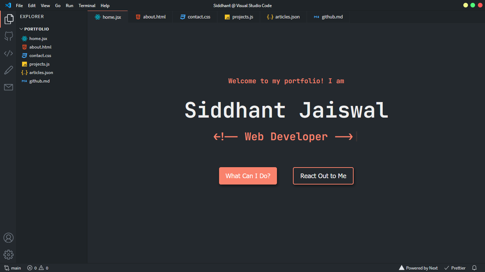

# My vscode themed portfolio

A Visual Studio Code themed developer portfolio website built with Next.js and deployed on Vercel.



<br>
<br>
<br>

## Features Roadmap

- [ ] Themes and customizations
  - [x] GitHub Dark (default)
  - [ ] One Dark Pro
  - [x] Dracula
  - [x] Ayu
  - [x] Nord

For other features and themes suggestions, please open an issue.

## Running Development Server

```bash
npm run dev
# or
yarn dev
```

Open [http://localhost:3000](http://localhost:3000) with your browser to see the result.

All VSCode related components can be found in the `components` folder. To change the content of the portfolio, check out the `pages` folder. To add or remove pages, modify `components/Sidebar.jsx` and `components/Tabsbar.jsx`.


### Cloning this repository from the Command Line
* If you have enabled two-factor authentication (GSA requirement) you will need to [create an access token for the command line](https://help.github.com/articles/creating-an-access-token-for-command-line-use/). (Save the token and use in next step.)
* Then follow instructions for [duplicating the repository](https://help.github.com/articles/duplicating-a-repository/). Use the token you generated in place of the password.

### Cloning this repository from the Github web interface
* From your github home page, select "[start a project](https://github.com/new)" or "[new repository](https://github.com/new)".
* Create this repository in the GSA organization.
* Enter the appropriate information for the new repository you are creating. Do not select "initialize this repository with readme".
* On the next page, select "import code from another repository".
* The next page is titled "Import Your Project To Github". In the box below "Your old repository’s clone URL", enter the source URL for this repository (listed above). Click "begin import".
* When the import is completed, you should see the "import complete" message.

### Making the cloned repository your own

* Modify the readme.md in the master branch with the name and details of your own documentation.
* In the repository settings, make this repository public. (Keep in mind you won't be able to put sensitive information in it.)
* Enable the GitHub pages web site by going to "Settings". In the "GitHub Pages" section, select "Master Branch /docs folder" and click the save button.
* GitHub will display a URL to your documentation web site. You will need to add "api-docs/" to this path to access the web site.
* You can add the link to this web page on the "code" tab of your repository (see this repo for an example). Go to the "code" tab of your repository, and click the "edit" button toward the top of the page. Enter the URL to your documentation (remember to add "api-docs/") in the "website" box, and add your own description in the "Description" box. Click save. You should see the link at the top of the "code" tab.

## Helping me improve
Please feel free to add issues and pull requests for any recommendations you think would be worthwhile for all users of the template.
